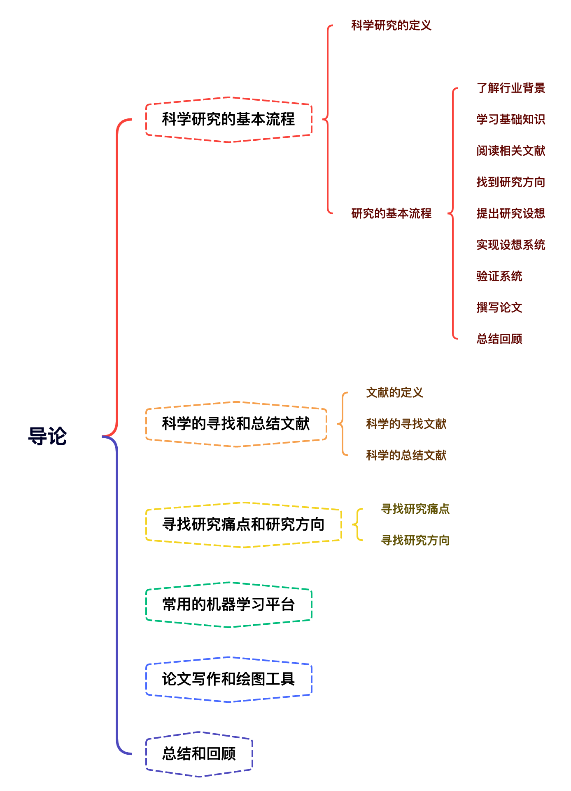

# 导论

## 思维导图

## 科学研究的基本流程
### 科学研究的定义 

**定义**

Research is "creative and systematic work undertaken to increase the stock of knowledge". It involves the collection, organization, and analysis of information to increase understanding of a topic or issue. A research project may be an expansion on past work in the field. Research projects can be used to develop further knowledge on a topic, or for education.

**目的**

扩展或提升目前的知识或技术\
为创造发明新产品和新技术提供理论依据

**手段**

数据采集\
数据组织\
数据分析

**实验验证**

### 研究的基本流程 
**1. 了解行业背景**

-   与导师或行业的师兄师姐进行咨询
-   浏览行业相关的导论性质书籍或视频

**2. 学习基础知识**

-   浏览行业核心书籍或视频
-   对书上的典型案例进行代码复现

**3. 阅读相关文献**

-   谷歌学术 <https://scholar.google.com>
-   中国知网 <https://www.cnki.net>
-   IEEE Xplore <http://ieeexplore.ieee.org>
-   ACM
-   Elsevier
-   Springer

**4. 找到研究方向**

-   应用方向（NLP，CV，HCI等）
-   找到研究痛点
-   技术方向（预处理算法，特征提取算法，分类器等）

**5. 提出研究设想**

-   理论调研和公式推导
-   技术实现可行性分析
-   实验数据库

**6. 实现设想系统和验证系统**

-   开源代码调研
-   编程和调试
-   实验设计
    -   数据清洗和预处理
    -   机器学习模型搭建
    -   环境，数据交互和可视化模块搭建
    -   训练和验证代码编写
    -   测试代码编写

**7. 撰写论文**

-   题目/作者/摘要 \@ref(abstract-conclusion)
-   引言 \@ref(introduction)
-   相关工作 \@ref(related-work)
-   提出方法 \@ref(approach)
-   实验 \@ref(experiments)
-   结论 \@ref(abstract-conclusion)
-   参考文献

**8. 总结回顾**

-   是否有相似论文最近发表
-   论文的理论和公式是否代码一致
-   实验结果复现
-   代码或数据库开源

## 科学的寻找和总结文献

**科学文献**是指通过一定的方法和手段、运用一定的意义表达和记录体系，记录在一定载体的有历史价值和研究价值的知识。

-   期刊，会议和学术论文
-   准确专业的百科网站（维基百科，百度百科等）
-   专业书籍（教科书、专著等）
-   报纸等其他专业准确的记录

### 科学的寻找文献
**1. 确定研究关键字**

-   所用的具体技术
    -   自监督学习
    -   弱监督学习
    -   傅立叶变换
    -   生成对抗网络（GAN）
    -   支持向量机（SVM）
-   应用场景
    -   人脸识别
    -   图像去噪
    -   语义分割
    -   同步建图与定位
-   发表时间和作者

**2. 搜索引擎+出版商**

-   谷歌学术 <https://scholar.google.com>（爬墙；学习高级检索）
-   中国知网 <https://www.cnki.net>
-   IEEE Xplore <http://ieeexplore.ieee.org>
-   ACM
-   Elsevier
-   Springer

**3. 什么论文值得读？**

-   顶级期刊会议
-   高引用
-   来自于著名学者/研究组

**4. 如何寻找重要的期刊会议？**

-   了解所在研究领域的重要期刊和会议
    -   CCF <https://www.ccf.org.cn/>
    -   中科院分区
-   重要期刊
    -   机器学习: IEEE PAMI，IEEE TNNLS， Machine Learning等
    -   计算机视觉:IEEE TIP，IJCV等
    -   语音处理:IEEE TASLP，ACM SLP等
    -   其他:IEEE Trans on Cybernetics，IEEE TFS，IEEE TAC，IEEE TMI，IEEE Trans on Robotics，Pattern Recognition等

### 科学的总结文献
**1. 阅读摘要**

-   论文研究目的（是否与自己的研究方向一致）
-   论文所用的方法（是否可以改进或应用到我的任务中）
-   论文方法的效果（该方法是否值得更深一步的研究）

**例子:**

The three-dimensional (3-D) path planning of unmanned aerial vehicles (UAV) is a multi-objective optimization problem. It aims to find a smooth, flyable, and optimal path from starting point to the target point in a complex environment.**（研究目的）** Traditional algorithms have difficulty ensuring the optimal path when faced with multiple objectives and complex cost functions. In this work, an improved butterfly optimization algorithm (IBOA) based on the virtual center butterfly (VCB) and Neighborhood dimension perturbation learning (NDPL) is proposed to solve the problem.**（研究方法）** Since BOA uses pairwise interactions between two random butterflies to perform the exploration. It makes the algorithm prone to miss the optimal solution, resulting in insufficient exploration capability. A novel VCB strategy was introduced into BOA to improve the exploration capability of the algorithm by creating attraction and repulsion effects on butterflies during the exploration phase. Meanwhile, the other individuals move toward the best individual in the exploitation phase, and if the best individual falls into the local extremes, it leads to premature convergence of the algorithm with low accuracy. A new NDPL is proposed, which constructs a neighborhood matrix after the BOA search is finished, then performs dimensional learning for each individual. The simulation experimental results in three scenarios show that the IBOA can acquire an effective and feasible route successfully, and its performance is superior to the other six algorithms.**（方法效果）**

**笔记**

-   研究目的:复杂环境中找到可行的、可飞的、最优的路径。
-   研究方法:an improved butterfly optimization algorithm (IBOA)。
-   方法效果:该IBOA方法可以成功获得有效可行的路径，并且比其他6种方法好。

**2. 阅读论文**

-   论文研究领域
-   论文所用方法:具体流程（框架），核心技术，创新点（点睛之笔），局限性
-   论文实验结果:应用场景，数据库，实验设计，实验结果
-   论文的结论

**笔记**

-   题目
-   研究领域的痛点及现状
-   方法，重要细节，创新点
-   实验结果及结论

💡做笔记是非常有必要的一步，相当于自制一份索引，日后忘记了还能快速拿起。

## 寻找研究痛点和研究方向
### 寻找研究痛点
**研究痛点的类别**

A.  研究领域内无人应用过机器学习方法，而传统方法存在机器学习可以解决的问题。

B.  研究领域内目前已有主流方法所存在的缺陷。

C.  研究领域内缺少开源数据库或常用工具。

D.  研究领域内缺少对比性或综述性论文。

**发现痛点后，调研研究痛点**

-   存在该痛点的原因（有利于解决问题）
-   该痛点对于研究领域的影响（无意义就没必要了）
-   解决该痛点的可行性（目前条件无法解决的也没必要）
-   解决该痛点的收益

### 寻找研究方向
**A. 研究领域内无人应用过机器学习方法，而传统方法存在机器学习可以解决的问题。**

-   若可以用机器学习方法解决该痛点，给予目前已有模型提出一种能解决该痛点的方法。 ✅
-   若不可以用机器学习方法解决该痛点，研究不能解决的原因，并通过多种方式验证这些原因。

**例子1**

1.  研究痛点，在精神健康（自闭症）方向未有直接利用CV或ML的方法
2.  可行性方面，对面部表情进行分析来检测的研究。
3.  解决收益方面，传统方法（看心理医生）速度慢，价格高，医生水平参差不齐；机器学习方法速度快，价格便宜，客观

**例子2**

1.  研究痛点，在汽车轮胎生产领域未有直接利用CV或ML的方法
2.  可行性方面，对轮胎图像进行分析来检测的研究。
3.  解决收益方面，传统方法（人工检测）速度慢，价格高，检测准确度低（人会疲惫）；机器学习方法速度快，价格便宜，检测准确度高

**B. 研究领域内目前已有主流方法所存在的缺陷。**

-   很多方法只在特定条件下效果好。✅
-   能解决的话，针对该缺陷提出解决方案:新的预处理，新的学习算法，新的数据扩增，引入多模态数据等。（只要能解决）
-   未解决的话，针对该缺陷对比多种解决方案。

**例子1**

问题 理想数据库中训练出来的人脸识别模型在光照变化大的地方检测准确度不佳。

1.  提出一个预处理方法:数据扩增，在训练时加入光照不一的图像。
2.  提出一个新的CNN模型，加一个支干专门用于去除光照影响。

**例子2**

问题 某顶级图像分类系统难以区分大小类似的驴和马。

1.  提出一个二次分类方法:在原系统分出来的结果之后，再进行一次二次分类，用于区分驴和马。
2.  提出一个新的特征提取方法:在原系统中加入一个特征提取，专注于驴和马核心区别的特征。

**C. 研究领域内缺少开源数据库或常用工具。**

-   开发方便使用，稳定且效果尚可的研究工具。
-   采集并建立可开源且符合行业标准的数据库。

**D. 研究领域内缺少对比性或综述性论文。**

-   将本行业的主流算法复现，并在多个数据库上进行测试对比。
-   撰写综述性论文。

## 常用的机器学习研究平台

-   MATLAB
    -   语言:Matlab
    -   优势:使用方便，库函数丰富，可在多个不同操作系统上使用
    -   劣势:其深度学习库运行速度较慢，不适合进行大型深度学习实验
-   Caffe
    -   语言:C++
    -   优势:速度快
    -   劣势:灵活性不足，难易上手，环境配置复杂
-   PyTorch
    -   语言:Python
    -   优势:使用方便，灵活，参考文档丰富，适合初学者研究使用
    -   劣势:无成熟的可视化接口，导出的模型较难移植
-   TensorFlow
    -   语言:Python
    -   优势:可视化程度高，说明文档丰富
    -   劣势:初学者使用较为复杂
-   Karas
    -   语言:Python
    -   优势:方便的API接口，模型搭建和导出简单
    -   劣势:灵活性较低
-   其他
    -   Theano
    -   MXNET
    -   Torch
    -   其他

## 论文写作和绘图工具
### 写作工具

-   Latex
-   共同协作平台 <https://www.overleaf.com>

### 绘图工具

-   Microsoft Power Point
-   Microsoft Power Visio
-   OriginLab
-   MATLAB
-   Photoshop

## 小宋老师的建议
**如何高效扎实的做研究**

-   不要着急直接进入项目，先将书上的案例用代码复现。
-   先做调研，发现值得研究的痛点，再开始研究。
-   阅读顶级期刊和会议的论文，做好记录。
-   先做研究，再写论文。
-   用Latex写论文。

