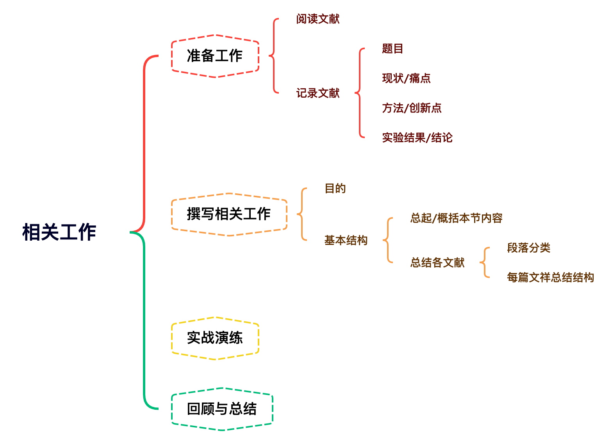

# 相关工作写作 {#related-work}
`what，why，when，how`

## 思维导图

## 准备工作
Related Work means that the overall goal is to describe the related research areas and to place your method's contributions to the field in this context.

### 阅读文献
- 研究方向的现状和背景
- 论文所解决的痛点
- 论文提出的方法:主要流程，核心算法，创新点
- 论文的实验结果和结论:方法的优越性和局限性

### 记录文献
- 题目
- 背景、现状、痛点
- 方法、重要细节、创新点
- 实验结果、结论

💡将笔记记在同一个文档里

**例子 1**

|||
|:---------| :-------------|
| 题目 | Deep Residual Learning for Image Recognition  | 
| 现状 | The depth of representations is of central importance for many visual recognition tasks. |
| 痛点 | Deeper neural networks are more difficult to train because of the vanishing/exploding gradient. While several solutions can deal with this issue, the accuracy of existing approaches still degrades rapidly with the networks depth increasing. |
| 方法 | Introducing a deep residual learning framework.  |
| 创新点 | The shortcut connections simply perform identity mapping.  |
| 实验结果及结论 |The results show that their approach allows deep network to be easier to train due to less complex strcuture and obtained the state-of-the-art performance on multiple image classification datasets|

💡在撰写相关工作章节前，在阅读研究相关的文献时，从所用技术，研究方向等角度尽量达到面面俱到的阅读和理解。同时，在阅读时一定要做好笔记，并根据文献类型进行分类。这样可以使在撰写相关工作章节时，高效，准确，快速。

## 撰写相关工作
### 目的
- The overall goal is to describe the **related research areas** and to place your method's contributions to the field in this context.

- By clearly describing previous work, you can **better describe the current
limitations** and **the need for new methodology**.

- It also gives you an opportunity to demonstrate knowledge of the area and **helps others relate your current work to other scientific areas**.

### 基本结构

- 总起/概括本节内容
- 总结各文献
  - 段落分类
  - 每篇文献总结结构
  

**第一部分:总结现有相关方法/章节的情况（可省略）**

**方法1:**

- 1-2句总起
  - In the past decade, many related studies have been proposed and published.
  - Since 1980, XXX (研究领域) has been rapidly developed.
  
- 总结现有相关工作的情况，对已有方法进行分类或时序排列
  - 分类  
  These approaches can be mainly categorized into three classes:1.XXX;2.XXX;3.XXX.
  - 时序  
  Early studies mainly focused on XXX (早期方法概述), which XXX (早期方法的缺陷). During XXX (中期某段时间), most researchers XXX (中期方法概述), but XXX (中期方法缺陷). In recent years, with the XXX (近期新方法的来源) becoming XXX (近期方法概述), this type of techniques have been widely employed in XXX (本文研究领域).

**方法2:**

- 对本章节结构进行概述
  - This section presents XXX in XXX. Then, XXX and XXX  are introduced in XXX , which  are followed by XXX.

**第二部分:分为多个部分/段落详细总结各篇论文**

**规划段落**

1. 按技术路线分类:每种技术路线的论文放在分/段落进行总结
1. 按应用领域分类:每种应用领域的论文放在一个部分/段落进行总结
1. 按技术-应用分类:与本文技术相关的论文放在一个部分/段落 ，与应用领域相关的论文放在一个部分/段落
1. 按技术发展阶段分类:每个阶段放在一个部分/段落
1. 根据其他研究逻辑来分类

**一些例子**

- 按技术分类   
  Albanie, Samuel, et al. "Emotion recognition in speech using cross-modal transfer in the wild." Proceedings of the 26th ACM international conference on Multimedia. 2018.
  - Video as stack of still images
  - Video as spatial-temporal volumes
  - Short and Long-Term Dynamics
  - Multi-Stream Networks
  - Motion Information
  - Learning to Rank Videos

- 按领域分类  
Hu, Han, et al. "Relation networks for object detection." Proceedings of the IEEE
Conference on Computer Vision and Pattern Recognition. 2018.
  - Object relation in post processing
  - Sequential relation modeling
  - Human centered scenarios
  - Duplicate removal

- 按研究逻辑和技术路线分类   
Junior, J. C. S.J., et al. "First impressions: A survey on computer vision-based apparent personality trait analysis." IEEE Transactions on Affective Computing
  - The importance of first impressions in our lives
  - How challenging and subjective can be apparent personality trait
labeling/evaluation?
  - Still Images
  - Image sequence
  - Audiovisual trait prediction
  - Multimodal trait prediction

**文献总结格式**

`目的-->方法-->细节/创新点-->结果/结论`

- Author proposed a method that XXX (方法细节/方法流程), which XXX (结果/结论).

- To deal with XXX (痛点), XXX (方法) was employed by sb, which XXX (解决痛点的细节), and achieved XXX (结果/结论).

**一些举例**

- 对每一篇文献详细分析

Biel et al. [17] studied personality impressions in conversational videos (vlogs) from facial expression analysis (目的). 
In their work, a subset of the Youtube vlog dataset [57] is adopted, as well as a facial expression model based on Facial Action Coding System (FACS) (方法).
The task of first impressions prediction is addressed using Support Vector Regression (SVR) combined with statistics of facial activity based on frame-by-frame estimates (细节1).
Moreover, they analyzed what specific facial expressions are most prominent for modeling each of the different impressions (细节2) .
Results show that extraversion is the trait showing the largest activity cue utilization, which is related to the evidence found in the literature that extraversion is typically easier to judge [58], [59] (结果).
Later, Aran and Gatica-Perez [60] studied the use of social media content as a domain to learn apparent personality traits, in particular extraversion, aiming to transfer the knowledge extracted from conversational videos to small group settings (目的).
Ridge Regression and SVM classifiers are combined with statistics extracted from weighted Motion Energy Images for the task of personality impressions prediction (方法/细节).

- 对文献进行方法分类

In low-level vision and computer graphics, for solving Partial Differential Equations (PDEs)(目的), 
the widely used Multigrid method [3] reformulates the system as subproblems at multiple scales,
where each subproblem is responsible for the residual solution between a coarser and a finer scale(方法/细节).
 An alternative to Multigrid is hierarchical basis pre-conditioning [44, 45], which relies
on variables that represent residual vectors between two scales(方法/细节). It has been shown [3, 44, 45] that these solvers converge much faster than standard solvers that are unaware of the residual nature of the solutions (结果结论). These methods suggest that a good reformulation or
preconditioning can simplify the optimization.

- 对文献进行时序分类

Practices and theories that lead to shortcut connections [2, 33, 48] have been studied for a long time(目的).
 An early practice of training multi-laver perceptrons (MLPs) (方法名称) is to add a
linear layer connected from the network input to thy, output [33, 48] (方法细节). In [43, 24], a few
intermediate layers are directly connected to auxiliary classifiers for addressing vanishing/exploding
gradients. (方法细节) The papers of [38, 37, 31, 46] propose methods for centering layer reponses,
gradients, and propagated errors, implemented by shortcut connections. In [43], an inception" layer
is com-posed of a shortcut branch and a few deeper branches. (方法细节)

**第三部分:总结已有方法的痛点（与本文研究方向相关）**

- 再次总结已有方法的缺陷和痛点
- 总结本文所依赖技术的优势
- 再次强调本文研究动机

## 实战演练

**通过笔记快速引出文献**

**1. 回顾笔记**

|||
|:---------| :-------------|
| 题目 | Deep Residual Learning for Image Recognition  | 
| 现状 | The depth of representations is of central importance for many visual recognition tasks. |
| 痛点 | Deeper neural networks are more difficult to train because of the vanishing/exploding gradient. While several solutions can deal with this issue, the accuracy of existing approaches still degrades rapidly with the networks depth increasing. |
| 方法 | Introducing a deep residual learning framework.  |
| 创新点 | The shortcut connections simply perform identity mapping.  |
| 实验结果及结论 |The results show that their approach allows deep network to be easier to train due to less complex strcuture and obtained the state-of-the-art performance on multiple image classification datasets|

**2. 提炼笔记**

|||
|:---------| :-------------|
|目的|To deal with the exploding gradient problem during the training as well as enhancing the performance of deep models.|
|方法|He et al. [1] proposed a deep residual network.|
|细节|The shortcut connections simply perfrom identity mapping, and their outputs are added to the outputs of the stacked layers.|
|结果|Obtained the state-of-the-art performance on multiple datasets and competitions.|

**3. 整理成段**

To deal with the exploding gradient problem during the training as well as enhancing the performance of deep models. He et al. [1] proposed a deep residual network, where the shortcut connections perform identity mapping, and their outputs are added to the
outputs of the stacked layers. The results showed that this model obtained the state-of-the-art performance on multiple datasets and competitions.

