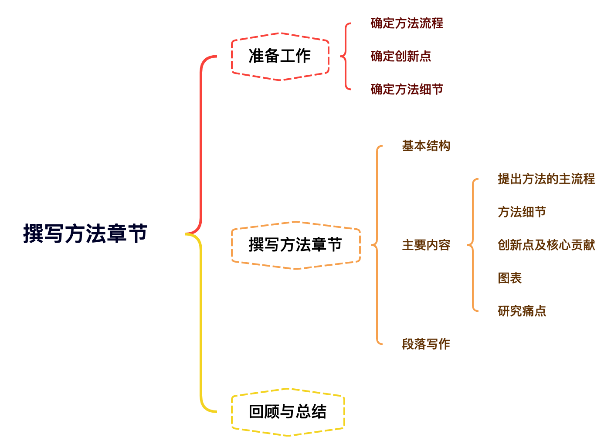

# 方法章节写作 {#approach}

## 思维导图

## 准备工作

**The proposed approach**

The methods section of a research paper provides the information by which a study's validity is judged. The method section answers two main questions:

1. How was the data collected or generated?
1. How was it analyzed?

- 确定方法流程:确定写作时的章节分类
- 确定方法创新点:确定写作风格
- 确定方法细节:确定每部分篇幅长短，完成公式推导

💡在撰写方法章节前，必须要已经完成研究，这样才可以确定好最终的方法流程及细节。在撰写章节时，论文中的内容一定要与代码相符合。

## 撰写方法章节
### 基本结构
**方法章节一般通过下列几种方式进行分节**

- 按方法步骤
- 按方法模块
- 按研究逻辑

### 主要内容
- 提出方法的主流程
  - 方法主流程一般除了在引言中介绍外，一般还需要在方法章节的开头进行总结性概述，并讲明每个章节所介绍方法的部分。
  - 在方法开头部分，一般最好加上本文方法的流程图

- 方法细节
- 创新点及核心贡献
- 图表
- 研究痛点

### 段落写作

- 在每一章节中，不要一上来就直接进入方法介绍，先从痛点或者提出方法所基于的基本技术开始这样有易于读者理解。
- 大部分段落最好在段落开始就表明本段的目的或者中心思想。

