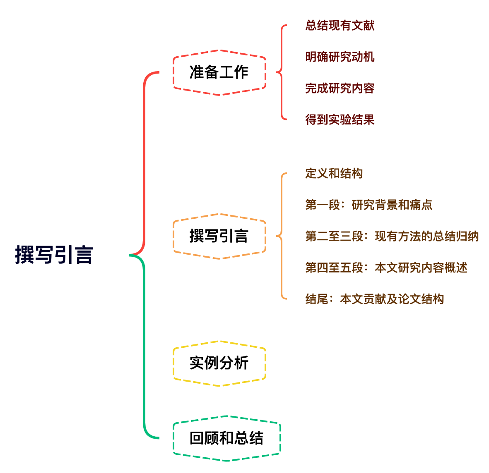
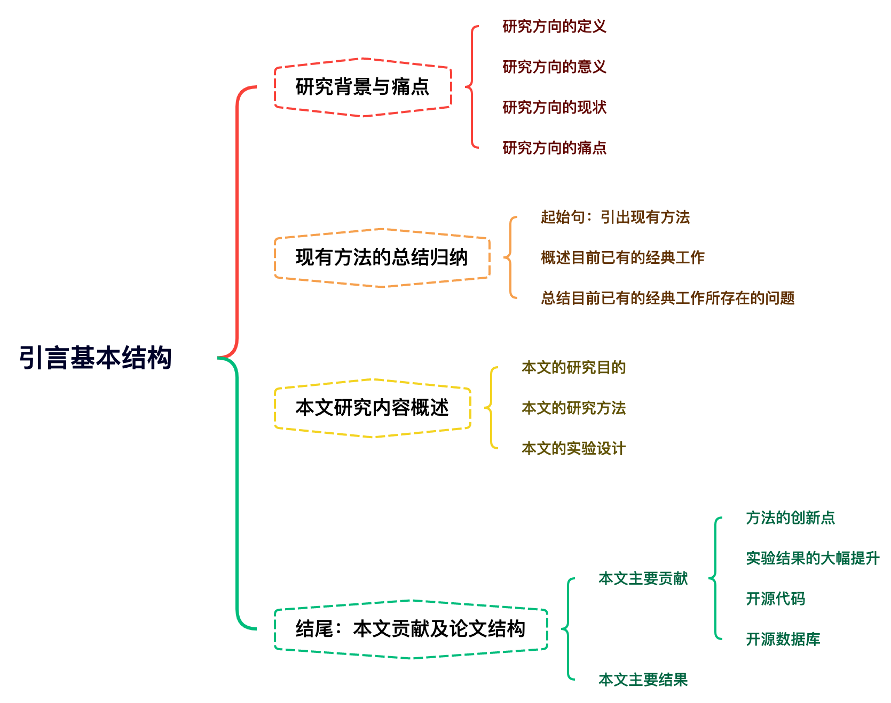
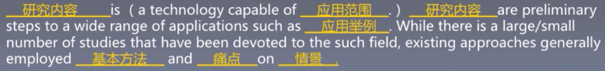
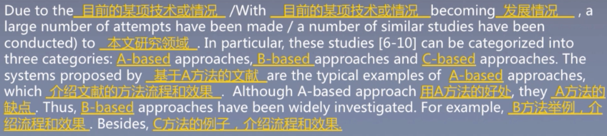
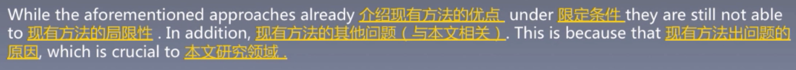
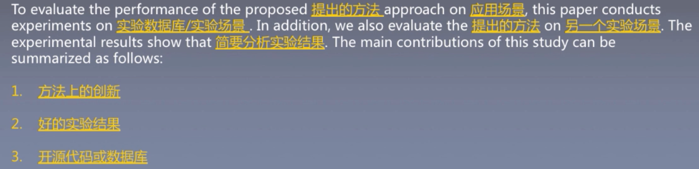
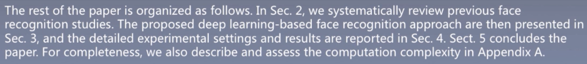

# 引言写作 {#introduction}
`what why when how`

## 思维导图

## 准备工作
The Introduction section clarifies the motivation for the work presented and prepares readers for the structure of the paper.

**1. 总结现有文献**

- 明确目前所研究方向的现状和背景
- 理解目前所研究方向的主流方法
- 找到目前主流方法的问题和缺陷

**2. 明确研究动机**

- 确定研究工作的重心
- 确定论文写作重心
- 确定实验方向

**3. 完成研究内容**

- 明确论文的主要贡献和创新点
- 明确最终使用的方法和研究细节
- 确定论文中需要书写的内容

**4. 得到实验结果**

- 确定论文实验内容
- 根据实验结果得到论文结论
- 寻找投稿目标期刊/会议

💡Introduction是总结性的章节，几乎需要包含研究工作的所有内容。因此在撰写前建议将总结好的文献完成的研究内容和实验结果都仔细回顾几遍，加深印象。在撰写时，建议将这些资料摆在一旁，以便随时查阅。

## 撰写引言
### 基本结构

### 研究背景和痛点

- 第一句，研究大方向的定义
- 第二句，研究方向意义
- 第三句，研究方向当前的大致现状
- 第四句，痛点（与我们研究内容相关的，方便引出下一段）

### 现有方法的总结归纳

**1. 起始句:引出现有方法**

用一句话引出当前已经提出的属于本文研究领域的方法:
  - (With XXX becoming XXX/Due to the recent advance in ххх), (a large number of attempts have been made/ a number of similar studies have been conducted) to XXX
  - XXX can be categorized into three fields: XXX, XXX and XXX
  - XXX is/are/becomes very popular in XXX field since XXX

**2. 概述目前已有的经典工作**

- 时序法:根据已有方法提出的时间先后顺序或发展顺序进行阐述。
- 分类法:根据已有方法所属的类别(如手工特征/深度特征，使用时序信
息/未使用时序信息等)分别阐述。

💡在总结各工作时，-般只需要用1-2句话，不宜太长(不然会与Related Work里内容重复)。总结时，需根据论文的研究内容，概述各工作的主要(相关)方法和优缺点。

**时序法举例**

In particular, most of these studies [6- 10] firstly extract hand-crafted visual descriptors from face images and then feed them to pre-trained classifiers for prediction (一句话总结). Very early studies generally XXX (用XXX方法) to obtain face representations, which XXX
(这些方法的缺点). To solve these problems, Walker et al. [6] proposed a XXX method that (介绍Walker的方法和效果). Alice et al. [7] XXX (介绍Alice的方法和效果). However, both approaches XXX (1个绍Walker和Alice方法的局限性). As a result, Luke et al. [8,9] and Yao et al. [10] specifically investigated XXX and (介绍近期更先进的方法及其如何解决之前方法的问题).

**分类法举例**

In particular, these studies [6-10] can be categorized into three categories: A-based approaches, B based approaches and C-based approaches (一句话总结). The systems proposed by Luke et al. [8,9]
and Yao et al. [10] are the typical examples of A-based approaches, which XXX (介绍Luke和Yao的方法和效果). Although A-based approach
XXX (包括用A方法的好处), they XXX (包括用A方法的缺点). Thus, B-based approaches have been widely investigated. For example, Alice et al. [7] XXX
(介绍Alice的方法和效果). Besides, Walker et al. [6]
extends C to face recognition tasks, by XXX (介绍Walker的方法和效果)

**3. 总结目前已有的经典工作所存在的问题**

一般来说，这一部分需要总结与本文内容相关的问题，并以此引出本文的
Motivation.
以人脸识别为例:
如果你的论文设计了一种在识别率更高但速度很慢的方法，那么此处就要总结现有方法准确率不足的问题和可能会导致的后果。如果你的论文设计了一种速度很快但准确度无明显提升的方法，那么论文中就要总结现有方法速度不足的问题和可能会导致的后果。

**举例**

While the aforementioned approaches already achieved good recognition performance (around 90% accuracy) [9] on the face dataset that collected under controlled environments [11]，they are still not able to provide reliable predictions on wild datasets [12-14]
(一句话总结现有方法，一般先扬后抑). In addition, XXX (如果一句不够，可以再加一句补充现有方法的缺点). This is because that existing hand-crafted visual descriptors are usually designed for general computer vision tasks without considering the face-specific information, which is crucial to face recognition tasks (具体分析当前方法的问题所在。由于我们是提出用深度特征来做人脸识别，自然我们所要提出的问题就要针对于当前的手工特征).

### 本文研究概述

**本文研究综述段落包含了研究目的，研究方法和实验设计。（呼应上一段最后一句话）**

1. 根据上段最后总结的现有方法的主要问题，提出本文的研究目的。
- To address/solve/deal with XXX, this paper presents/proposes XXX
- In this paper, we aims to XXX by XXX
- As a consequence, this paper XXX

2. 提出具体的解决方案。
- 基于哪些已有的算法
- 提出方法的主要流程及原理
- 提出方法的创新点是什么

**举例**

In this paper, we extend Convolution Neural Networks (CNNs) to the face domain (基于CNN算法). Specifically, the proposed approach starts with generating aligned face removing all background noises. Then, it feeds training faces to the proposed CNN model, paired with the corresponding labels. This way, the weights of the utilized CNN would be optimized, in order to correctly recognize the identity of the input face. In other words, the deep learned descriptors, which are generated by the well-trained CNN, are task -specific (本文方法步骤和原理). To the best of our knowledge, this is the first attempt to extract deep face descriptor for face recognition task (本文的创新点).

3. 提出验证方案。
- 需要做哪些实验
- 实验目的是什么
- 简略叙述实验结果

**举例**

To evaluate the performance of the proposed deep learning approach on both controlled and wild conditions, this paper conducts experiments on XXX dataset and XXX dataset (需要做哪些实验和实验目的). In addition, we also evaluate the learned deep feature
on XXX face tasks (如果还有除主实验外的实验，可以在这里添加). The
experimental results show that (简要分析实验结果).

4. 本文的主要贡献
- 方法的创新点
- 实验结果的大幅提升
- 开源代码
- 开源数据库

### 结尾:本文贡献及论文结构

1. 本文的主要贡献

The main contributions of this study can be summarized as follows:
This paper proposes the first deep learning-based face recognition system, which learns task-specific face descriptors rather than hand-crafted general visual descriptors (方法和创新).
The proposed approach achieved the state-of-the-art XXX performance on XXX dataset and XXX dataset, clearly outperform other existing approaches (当前最好的效果).
The code of the paper is made publicity available at XXX (开源代码).

2. 本文的主要结构

The rest of the paper is organized as follows. In Sec. 2, we describe ххх. XXх are then presented in Sect. 3, and the XXX are
presented/reported in Sect. 4. Sect. 5 concludes the paper. For completeness, we also describe and assess XXX in Appendix A.

## 实例分析

Face recognition system is a technology capable of identifying or verifying a person from a digital image or a video frame from a video source (定义). Face recognition are preliminary steps to a wide range of applications such as personal identity verification [1, 2], video-surveillance [3], lip tracking
[4,5], facial expression extraction [6-8], etc (意义). While there is a large number of studies that have been devoted to the such field, existing approaches generally employed various hand-crafted visual
descriptors and generated relatively low and unstable recognition performance on wild datasets (大致情况和痛点).

Due to the recent advance in hand-craft features and classifiers, a large number of attempts have been made to face recognition area. In particular, these studies [6-10] can be categorized into three categories: A-based approaches, B-based approaches and C-based approaches (一句话总结). The
systems proposed by Luke et al. [8,9] and Yao et al. [10] are the typical examples of A-based
approaches, which XXX (介绍Luke和Yao的方法和效果). Although A-based approach XXX (包括用A方法的好处)，they XXX (包括用A方法的缺点). Thus, B- based approaches have been widely investigated. For
example, Alice et al. [7] XXX (介绍Alice的方法和效果). Besides, Walker et al. [6] extends C to face recognition tasks, by XXX (介绍Walker的方法和效果).

While the aforementioned approaches already achieved good recognition performance (around 90% accuracy) [9] on the face dataset that collected under controlled environments [11]，they are still not able to provide reliable predictions on wild datasets [12-14]
(一句话总结现有方法，一般先扬后抑). In addition, XXX (如果一句不够，可以再加一句补充现有方法的缺点). This is because that existing hand-crafted visual descriptors are usually designed for general computer vision tasks without considering the face-specific information, which is crucial to face recognition tasks (具体分析当前方法的问题所在。由于我们是提出用深度特征来做人脸识别，自然我们所要提出的问题就要针对于当前的手工特征).

As a consequence, this paper proposes to extract task- specified descriptors for face recognition, aiming to further enhance the face recognition performance under both controlled and wild conditions. In this paper, we extend Convolution Neural Networks (CNNs) to the face domain (基于CNN算法). Specifically, the proposed approach starts with generating aligned face removing all background noises. Then, it feeds training faces to the proposed CNN model, paired with the corresponding labels. This way, the weights of the utilized CNN would be optimized, in order to correctly recognize the identity of the input face. In other words, the deep learned descriptors, which are generated by the well-trained CNN, are task-specific (本文方法步骤和原理). To the best of our knowledge, this is the first attempt to extract deep face descriptor for face recognition task (本文的创新点).

To evaluate the performance of the proposed deep learning approach on both controlled and wild conditions, this paper conducts experiments on XXX dataset and XXX dataset (需要做哪些实验和实验目的). In addition, we also evaluate the learned deep feature on XXX face tasks (如果还有除主实验外的实验，可以在这里添加). The experimental results show that (简要分析实验结果). The main contributions of this study can be summarized as follows:
The main contributions of this study can be summarized as follows:

1. This paper proposes the first deep learning-based face recognition system, which learns task-specific face descriptors rather than hand-crafted general visual descriptors (方法和创新).

1. The proposed approach achieved the state-of-the-art XXX performance on XXX dataset and XXX dataset, clearly outperform other existing approaches (当前最好的效果).

1. The code of the paper is made publicity available at XXX (开源代码).

The rest of the paper is organized as follows. In Sec. 2, we describe ххх. XXх are then presented in Sect. 3, and the XXX are
presented/reported in Sect. 4. Sect. 5 concludes the paper. For completeness, we also describe and assess XXX in Appendix A.

## 模版

## 小宋老师建议

- 多阅读不同类型论文的引言
- 对阅读过的引言进行成分分析
- 把同一种内容的引言用不同的风格写出来

