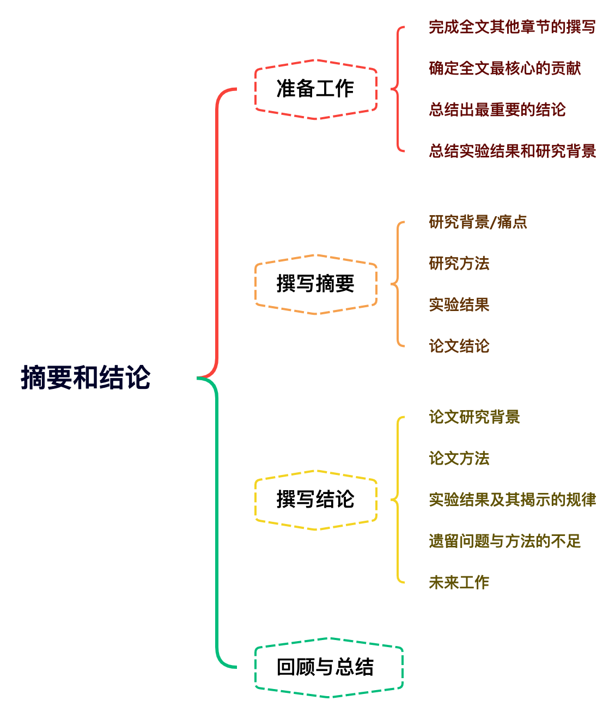

# 摘要和总结 {#abstract-conclusion}

## 思维导图

## 准备工作

**定义**
摘要和结论部分均属于总结概括性质的章节。因此，在撰写A|科学论文时，一般完成全文其他部分后，最后再进行摘要和结论的撰写。

- 完成全文其他章节的撰写
- 确定全文最突出/最核心的创新点或贡献(一般不超过三个)
- 根据实验结果总结出最重要/最显著的结论
- 简短总结实验结果和研究背景

## 撰写摘要

**摘要四要素**

- 研究背景/痛点(1-2句): 痛点需要是本文研究需要解决的问题
- 研究方法(2-4句): 方法流程或核心算法
- 实验结果(1-2句):实验设定，实验结果
- 论文结论(1句):总结结果，什么条件下你的方法好

## 撰写结论章节
**结论需要包含**

- 简单的概述论文方法和解决了什么问题✔️
- 简单介绍实验结果
- 分析实验结果说明了什么问题及所揭示的所提出方法的原理，规律和优势✔️
- 根据实验结果，总结所提出方法的应用价值
- 本文方法遗留的问题及不足
- 与本文相关未来的工作计划

**模版**

- 研究背景/痛点(1句):痛点需要是本文研究需要解决的问题
- 研究方法(2句):方法流程或核心算法
- 实验结果(1-2 句):实验设定，实验结果
- 根据实验结果得到的各个结论(3-5句)
- 本文方法的不足和未来工作(2-3句)

