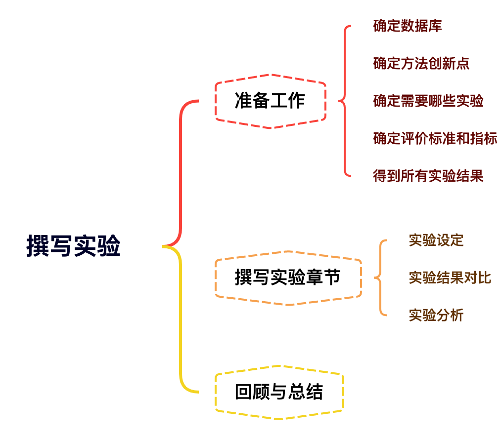

# 实验结果 {#experiments}
## 思维导图

## 准备工作
This section should present and discuss the research results, respectively. However, because readers can seldom make sense of results alone without accompanying interpretation they need to be told what the results mean.

- 确定实验数据库
  - 是否有公共数据集
  - 多个公共数据集中哪些最适用于本文
  - 使用多少个数据集
  - 是否有特殊部分需要用其他任务进行验证
- 确定类似论文实验章节结构:确定大致需要做哪些实验
- 确定方法创新点:确定需要重点分析方法哪些部分
  - 方法中各元素重要性分析对比
  - 本文方法与其他近期方法对比
  - 可靠性/收敛速度/方法中间变量等分析
- 确定评价标准和指标
  - 分类问题:Recall, Precision, F1, Accuracy 等
  - 回归问题:MAE, MSE, PCC, CCC等
  - 其它:Inception Score等
- 得到所有实验结果:确定哪些结果需要放在论文中
  - 不是所有的结果都需要放在论文中。
  - 扬长避短:选择支持论文结论的结果。
  - 选择的底线:实验结果不能造假，不能选择靠巧合得到的结果，真实实验结果必须与论文中的结论匹配。

💡在撰写实验章节前，必须要完成所有的实验并获得结果，这样才可以确定好最终需要将哪些结果放上论文。在撰写实验章节时，除了整体系统与他人方法对比外，还需要添加能突出论文方法创新点的实验结果。

## 撰写实验章节

- 实验设定
- 实验结果对比
- 实验分析

### 实验设定

- 数据库介绍:名称，数据形式，采集方式，标签，样本量等。
- 实验结果衡量指标
- 实验操作细节:代码依赖软硬件平台，训练验证设定，超参数设定，预处理等。
- 其他tricks

### 实验结果对比

- 本文方法各模块性能/贡献分析(Ablation studies)
- 本文方法与他人方法对比

### 实验分析

- 超参数敏感性分析
- 收敛速度
- 其他

## 回顾与总结

**模版**

- 数据库介绍(Database)

- 操作细节(Implementation details)

- 度量指标(Evaluation Metrics)

- 实验结果(Experimental Results)

  - Ablation studies

  - Comparison to others

- 实验结果分析(Result analysis/Discussions)

